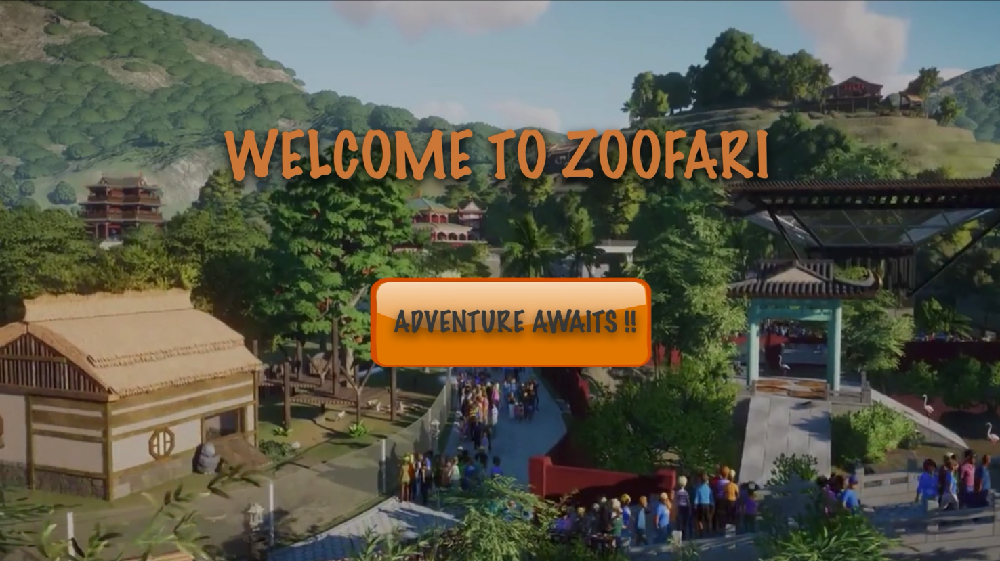
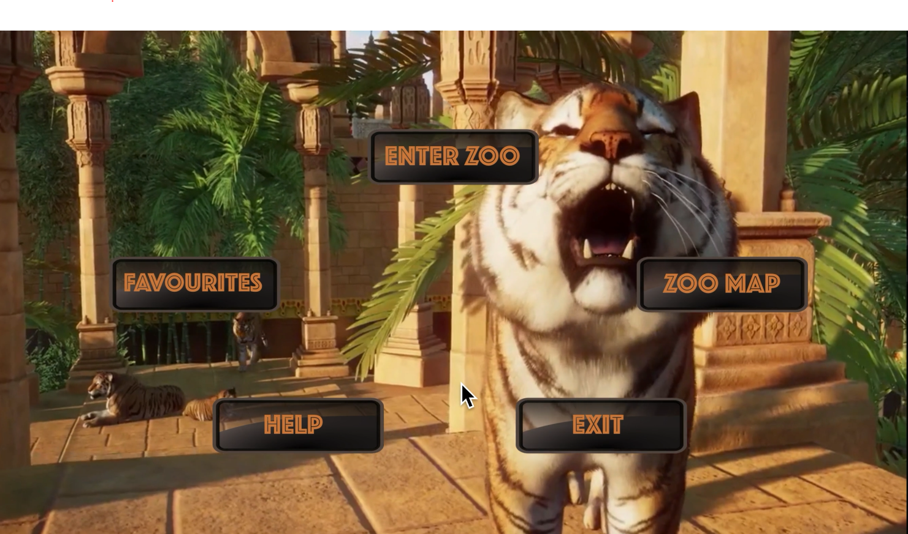
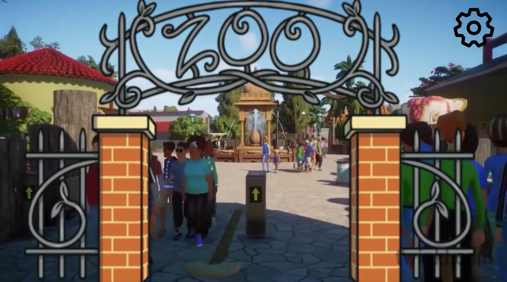
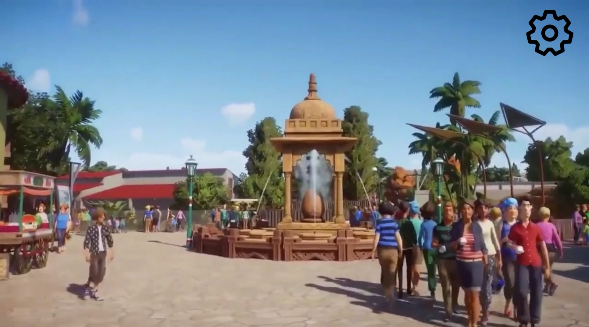
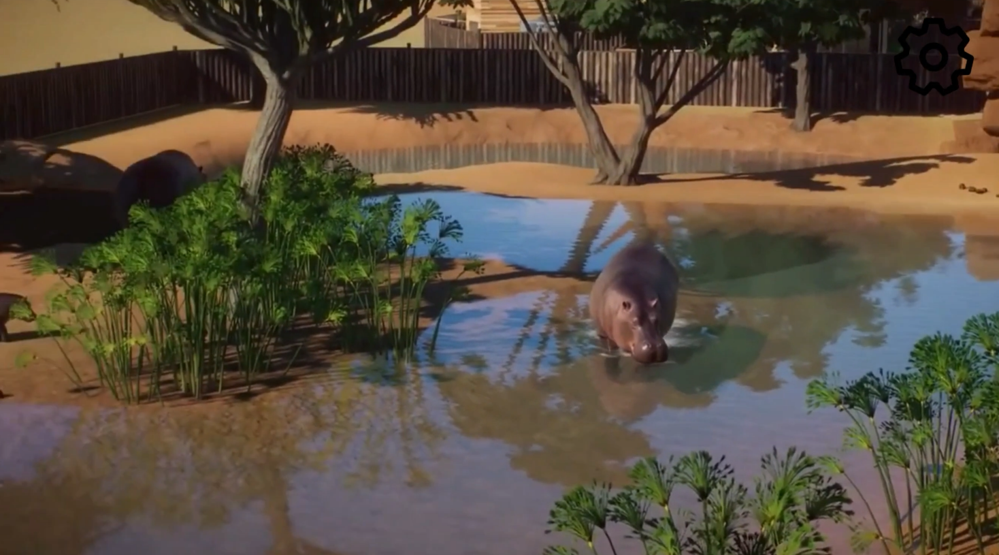
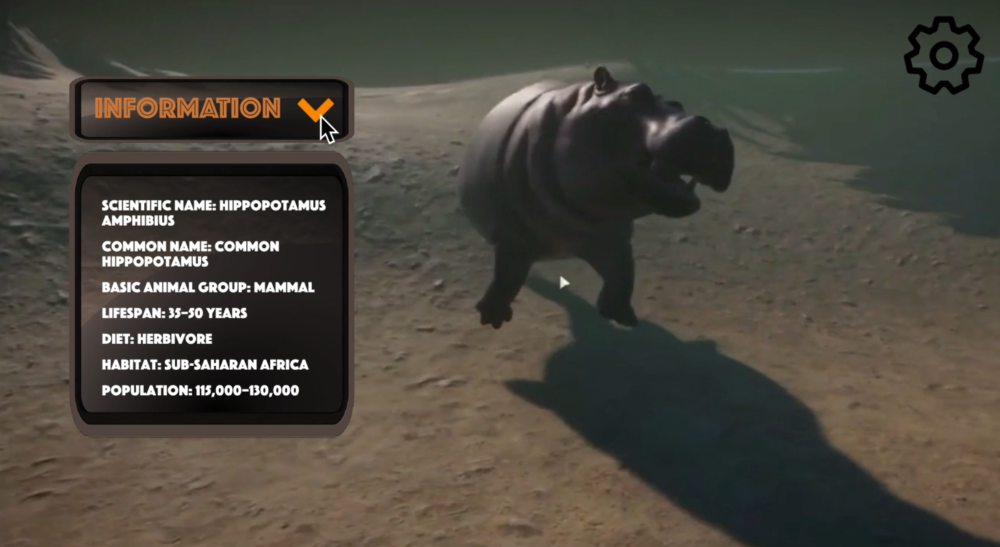
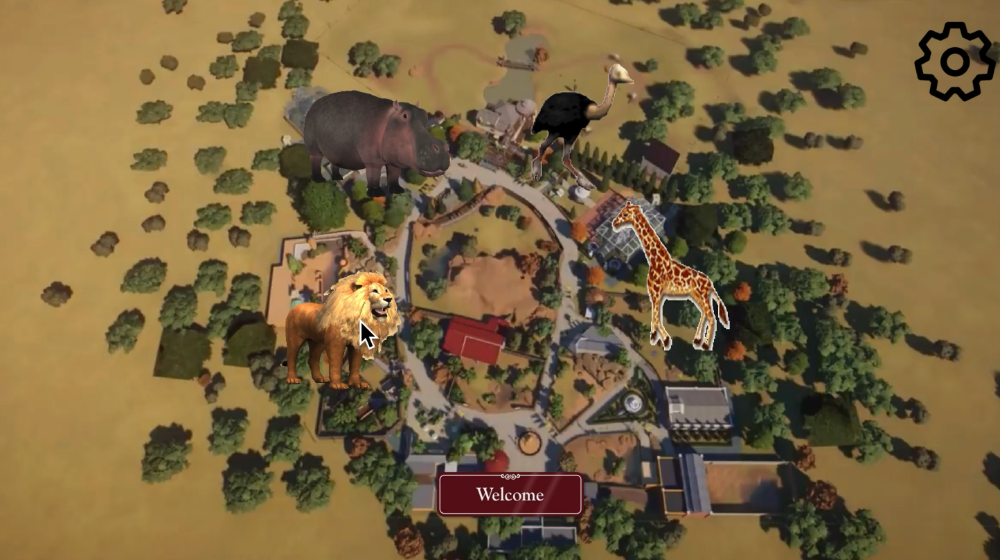
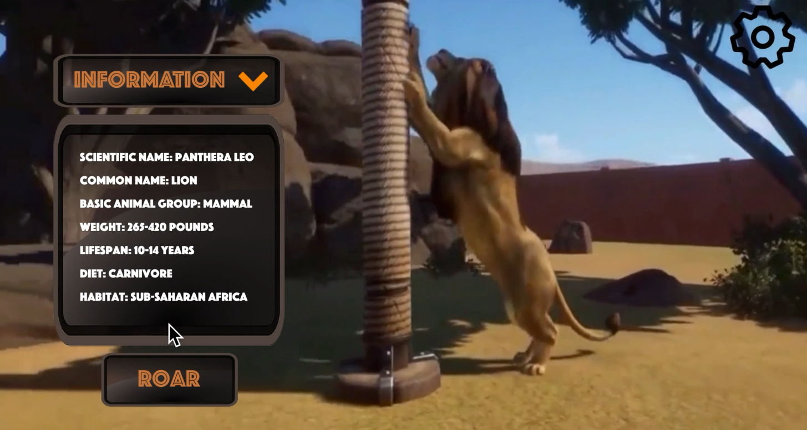
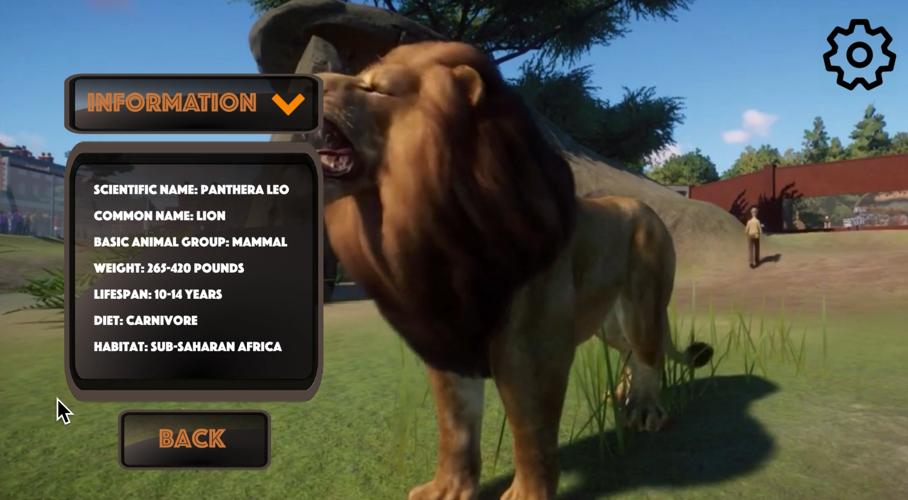
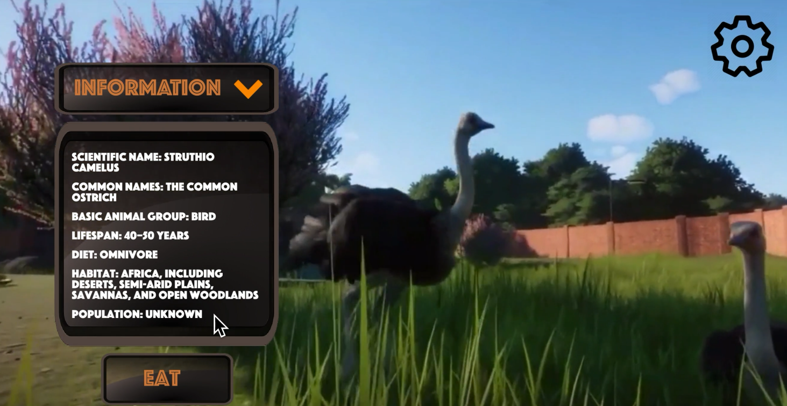

**High Fidelity Prototype**

I have created the application in Flinto with the visuals and the connections. Below are few screens that are used in the application. 

Note: I have attached a video file for the full application where you can see all the screens. Click on the link to view the mp4 file 
<a href="https://drive.google.com/file/d/1ebVkbj713BYjr1pQKy8SNrEwCx_G2S3b/view?usp=sharing">Zoofari</a>.

<a href="https://drive.google.com/file/d/1R7uJX8GN0AByOGvmxKNTmH0zt2FUDDtX/view?usp=sharing">Click Here</a> to download the flinto file

**Welcome Screen**

**Selection Screen**

**Front Gate Screen**

**Navigation Screen**

**Animal Navigation Screen**

**Hippopotamus Information Screen**

**Zoo Map Screen**

**Lion Information Screen**

**Lion Roar Screen**

**Ostrich Information Screen**

