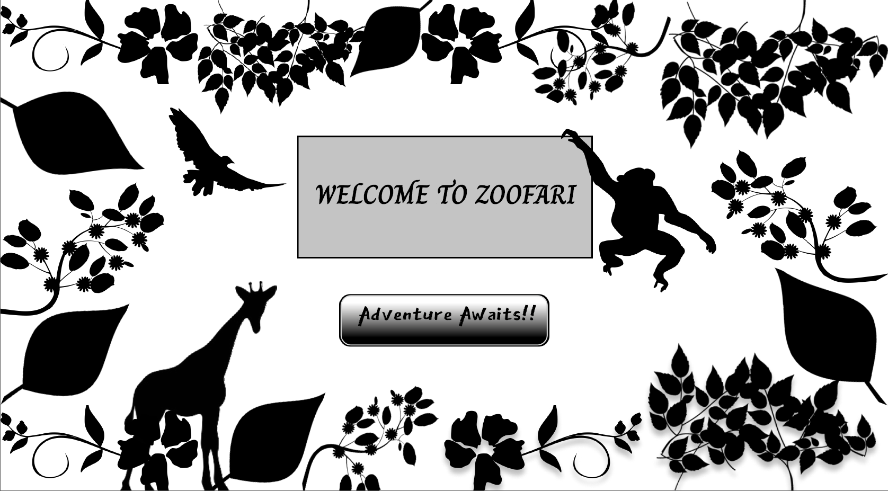
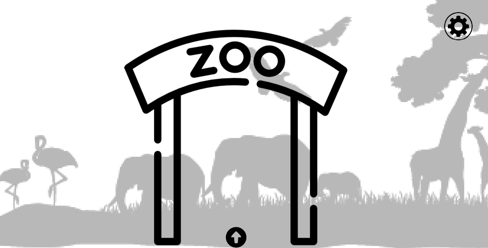
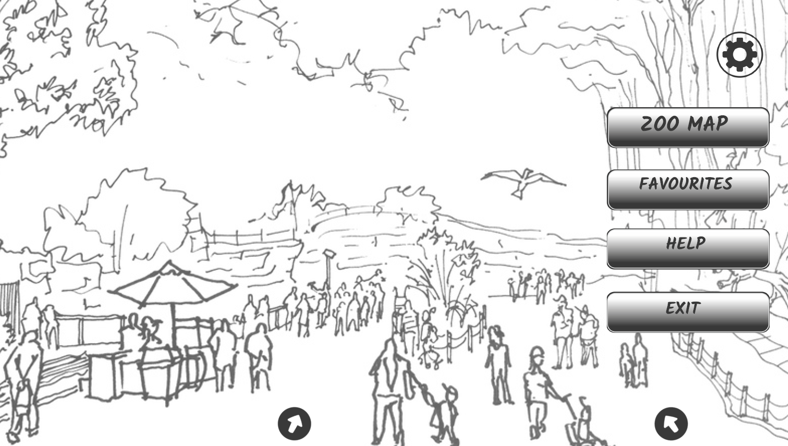
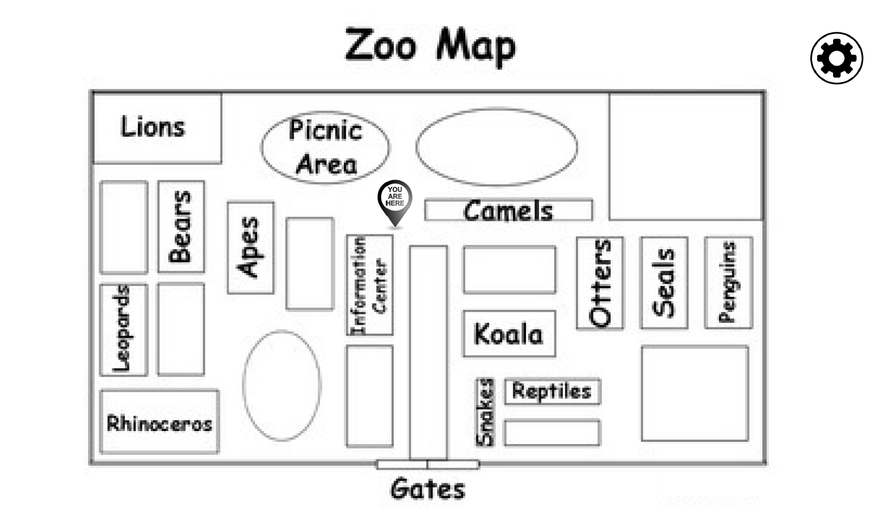
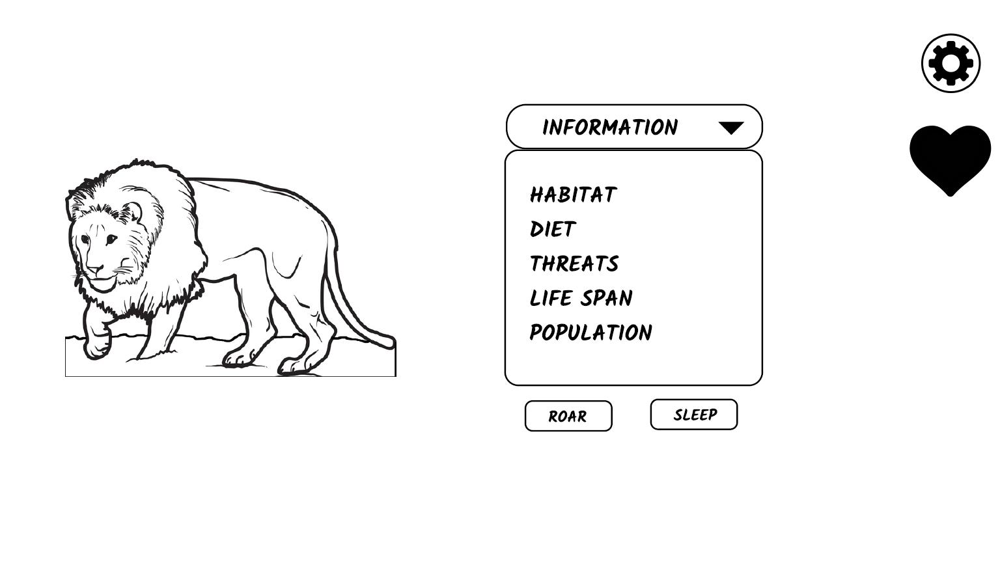
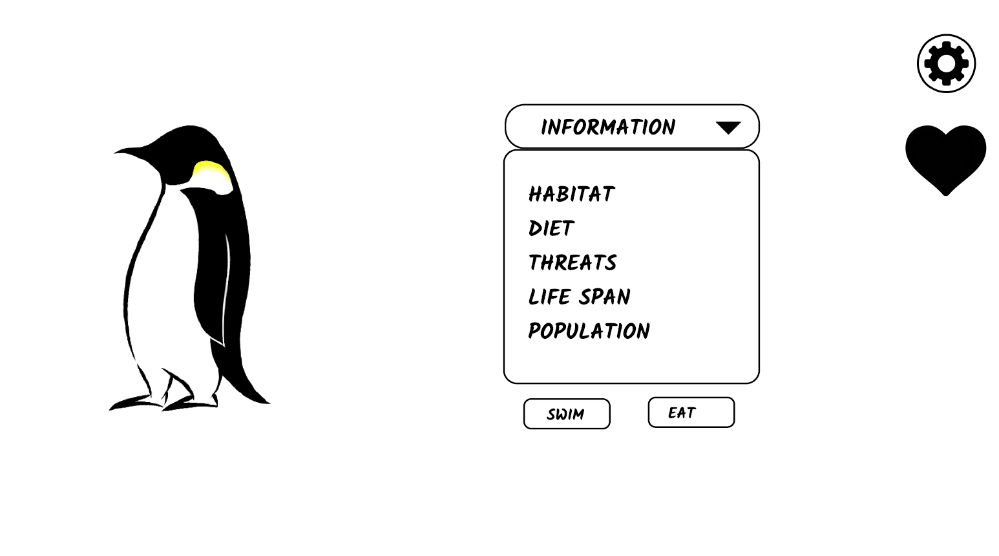
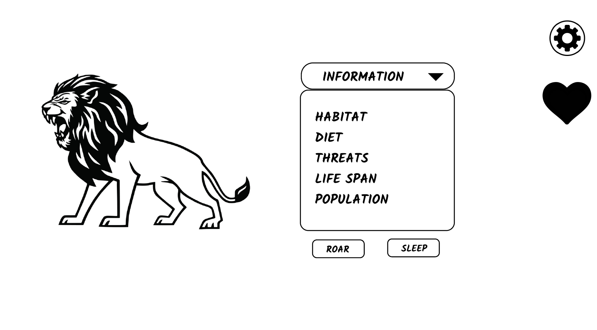
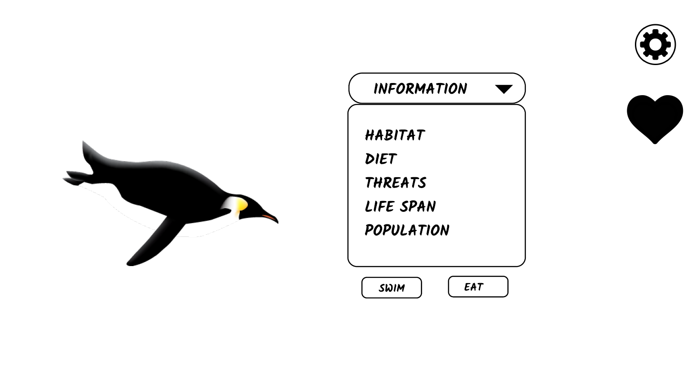

**Wireframes**

I have created wireframes using Figma Tool. 
The wireframes are connected to each other and I have added links in the buttons for the connections.
<a href="working-mock/PDF wireframes.pdf">Click Here</a> to download the pdf of wireframes.

<a href="working-mock/Zoofari Wireframing.png">Click Here</a> to download the consolidated png file of wireframes.

Note : You need to download the pdf in order to access the button click events.

**Home Screen wireframe**

**Selection Screen wireframe**

**Entrance Screen wireframe**

**Navigation Screen wireframe**

**Zoo Map wireframe**

**Lion information wireframe**

**Penguin information wireframe**

**Lion roar wireframe**

**Penguin swim wireframe**

